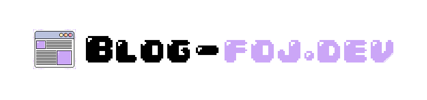

	

> Um blog pessoal dedicado a tornar a programação acessível para todos, com artigos práticos e didáticos sobre desenvolvimento de software.

  
  

## 📝 Sobre o Projeto

Este blog foi criado com o objetivo de compartilhar conhecimento de forma **simples e acessível**. Todo o conteúdo é desenvolvido pensando em facilitar o aprendizado, utilizando:

- Linguagem clara e objetiva;
- Muitas imagens e exemplos visuais;
- Organização intuitiva;
- Explicações práticas e diretas.

Acesse: https://foj-dev.vercel.app/

## 🎯 Sistema de Dificuldade

Os artigos são organizados por níveis de dificuldade para facilitar sua jornada de aprendizado:

- 🟢 **Básico** - Para quem está começando;
- 🟡 **Médio** - Para quem já tem alguma experiência;
- 🔴 **Avançado** - Para quem busca se aprofundar.

## 📚 Conteúdos Abordados

- Variáveis;
- Memória;
- E muito mais...

## 📅 Frequência de Publicação

Novos artigos são publicados **a cada 15 dias**, garantindo conteúdo de qualidade regularmente.

## 💡 Por que?

Ao longo do meu tempo de faculdade percebi que adorava escrever e que muitos conteúdos infelizmente não são explicados de uma forma simples para que qualquer possoa possa entender, depois de começar a escrever um livro de Rust percebi a necessidade de criar um blog para ir compartilhando pequenos artigos que pudessem complementar o livro e que fossem fáceis o suficiente para ajudar na construção de uma base mais sólida de muitos programadores.

## 🤝 Contribuições

Sugestões de temas e feedback são sempre bem-vindos!

Tem sugestões, dúvidas ou encontrou algum erro? Envie um email para: nilton.f.o.junior@gmail.com

---

	Feito com ❤️ para a comunidade dev

